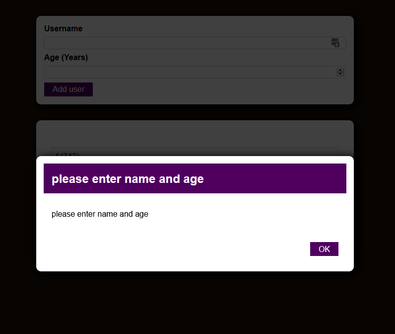

```
npm install
npm start
```

# Practise project oppgave
På egenhånd, forsøk å lag en app hvor man skriver inn i input felt og kan legge til dette som et listeelement i en liste, og input values skal forsvinne. \
Hvis input er feil skal man ved submit i stedet for få en error popup. Ved klikk på "OK" eller backdrop skal popup forsvinne.

Input og liste \


Error popup \


# Hvordan det gikk
Jeg fikk lagd alt unntatt error popup. Hadde ikke en anelse på hvordan jeg skulle gjøre det, så bare byttet dem ut med vanlig *alert()* (commit "Forsøk på å ..." b9b6956).

Etter å ha fulgt løsnignene til oppgaven så jeg også at jeg måtte refaktorere koden her og der, og lagt inn error popup (commit "fullfører practise project ..." 62c6bd0).

Ellers er commits etter 20. april videreutvikling av appen, ikke en del av oppgaven over, og for det meste fulgt etter videoene